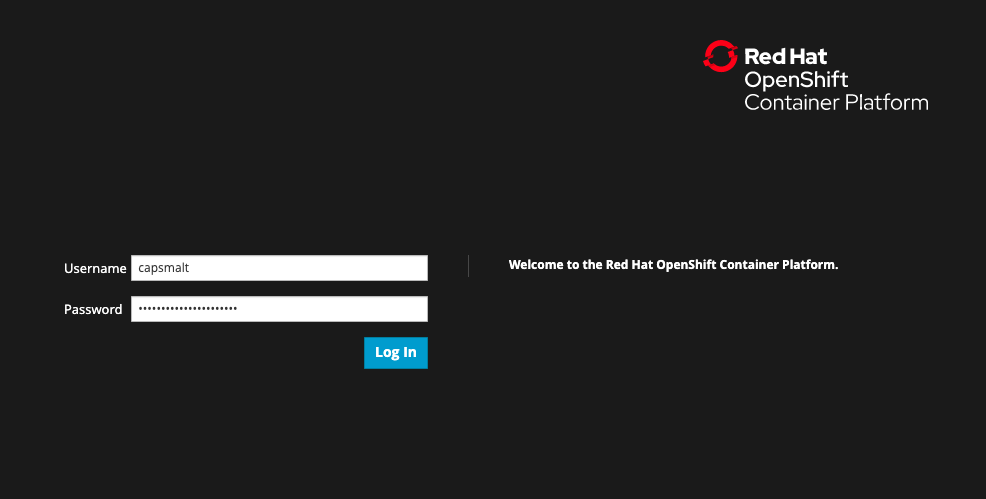
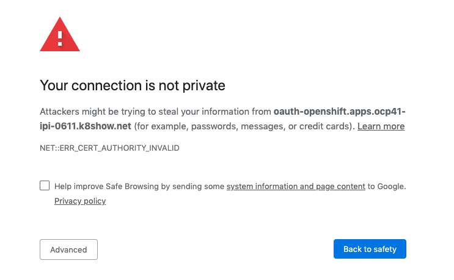
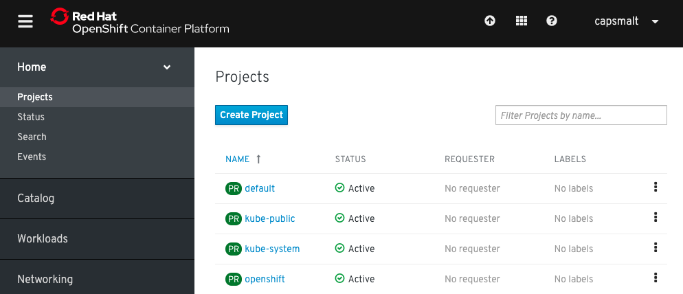
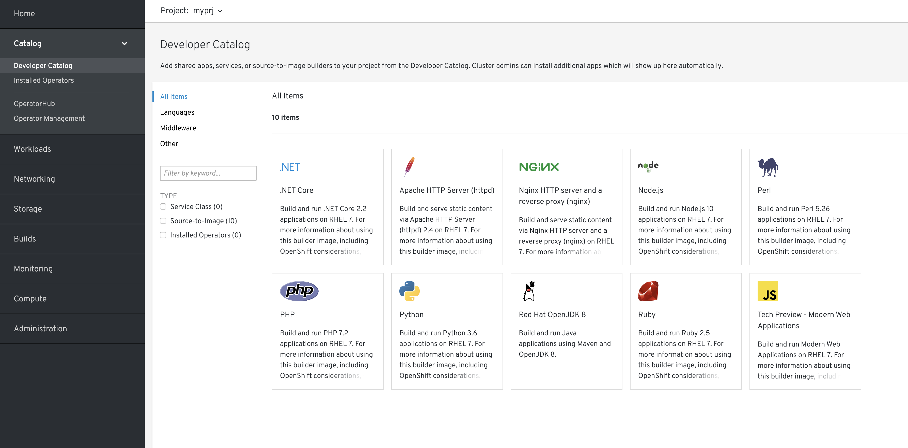
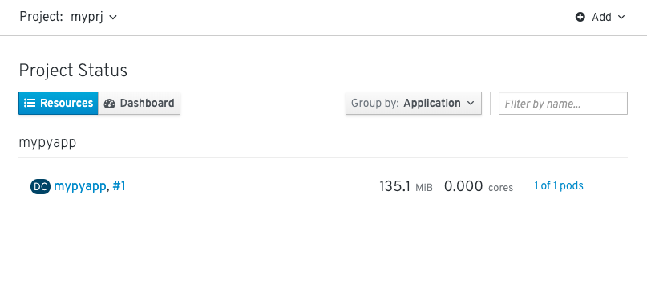

Lab1. OCP4の構築とコンテナビルド&デプロイ では以下の内容実施します。
- OCP4クラスターの構築 (本日は実施しません。クラスターは構築済です)
- OCP4 コンソールツアー
- コンテナイメージのビルドとデプロイ

# OCP4クラスターの構築
## AWS環境の準備
1. AWSアカウントの作成
1. IAMユーザー作成(AdministratorAccessポリシーをセット)
1. sshキーペアを作成
    ```
    ssh-keygen -t rsa -b 4096 -f ~/.ssh/id_rsa_ocp
    ```
1. アクセスキー取得
1. シークレットアクセスキー取得
1. AWS CLI取得
    - https://docs.aws.amazon.com/ja_jp/cli/latest/userguide/install-bundle.html
1. AWS CLIを使ってAWSアカウント関連のセットアップ
    ```
    $ aws configure
    ```
    - アクセスキー
    - シークレットアクセスキー
    - デフォルトリージョン
    - etc.
    
1. AWSリソース制限緩和 (新規アカウント作成時はリソース利用可能量が小さいので注意)
   - Elastic IP
   - EC2
   - VPC
   - NLB
   - etc.

    >参考:
    >
    >OCPが必要とするリソース計算ツール
    >https://access.redhat.com/labsinfo/ocplimitscalculator


|タイプ|対象のサービス|リージョン|期待するLimit値
|:---:|:---|:---|:---:|
|VPC|VPC Elastic IPアドレス|アジアパシフィック(東京)|4|
|VPC|AZあたりのNATゲートウェイ|アジアパシフィック(東京)|1|
|VPC|リージョンあたりのゲートウェイVPC|アジアパシフィック(東京)|1|
|EC2|EC2インスタンス  (m4.large)|アジアパシフィック(東京)|3|
|EC2|EC2インスタンス  (m4.xlarge)|アジアパシフィック(東京)|3|
|ELB|Network Load Balancer|アジアパシフィック(東京)|5|

上記はOCP4 on AWS 1クラスターだけ作る場合
(最新情報は都度確認ください。上記は2019/6/26時点のものです。)

## OCP4インストーラおよびクライアントCLIの取得
IPIを使用してK8s(OCP)クラスターを構築します。
1. OCP4を構築するための Get startedページを開きます

    ==> https://cloud.redhat.com/openshift/install

    (※Red Hat ID 未所持の場合は，新規に作成します。)

1. インストール先のプラットフォームは， **AWS** を選択します
1. インストール方法は，**Installer-Provisioned Infrastructure** を選択します
1. インストーラおよびクライアントのCLIをダウンロードします
    - ファイルサーバー(https://mirror.openshift.com/pub/openshift-v4/clients/ocp/latest/) から以下の2つを取得できます
        - **openshift-install**
          - OCPをインストールするためのCLI (Mac/Linux用あり)
            - Mac: https://mirror.openshift.com/pub/openshift-v4/clients/ocp/latest/openshift-install-mac-4.1.3.tar.gz
            - Linux: https://mirror.openshift.com/pub/openshift-v4/clients/ocp/latest/openshift-install-linux-4.1.3.tar.gz
        - **oc**
          - OCPを制御するためのCLI (Mac/Linux/Windows用あり)
            - Mac: https://mirror.openshift.com/pub/openshift-v4/clients/ocp/latest/openshift-client-mac-4.1.3.tar.gz
            - Linux: https://mirror.openshift.com/pub/openshift-v4/clients/ocp/latest/openshift-client-linux-4.1.3.tar.gz
            - Windows: https://mirror.openshift.com/pub/openshift-v4/clients/ocp/latest/openshift-client-windows-4.1.3.zip
    >Tips:
    >
    >ocコマンドやopenshift-installコマンドは，/usr/local/binに入れずに，直下のディレクトリで実行しても構いません。ocコマンドは頻繁に使用するため今回はパスを通しておくことをおすすめします。
    >
    >また，homebrewで `brew install openshift-cli`のようにして導入することもできます。(Mac)

## OCP4インストール用Configの作成
1. インストール用の設定ファイルを作成します

    ```
    $ openshift-install create install-config
    ```
    
    上記実行後に，OCPインストール先となるAWS環境情報をインタラクティブに入力(選択)します。
    - provider: aws
    - region: <任意>
    - domain: <Route53で事前取得したドメイン>
    - cluster name: 任意
    - aws access key: <IAMで確認>
    - aws secret key: <IAMで確認>
    - pull secret: <cloud.redhat.comから取得>

         (※**Pull Secret** はRed Hat IDごとに異なります)  
    >参考: [AWSに導入する場合のカスタマイズ設定](https://docs.openshift.com/container-platform/4.1/installing/installing_aws/installing-aws-customizations.html#installation-configuration-parameters_install-customizations-cloud)


1. インストール用の設定ファイルをコピーして保管しておきます

    ```
    $ cp -p install-config.yaml{,.bak}
    ```
    
    >Tips:
    >
    >openshift-installコマンドでクラスター構築を行った際に，install-config.yamlはdeleteされてしまうため，何らかの形でバックアップを取っておくことをおすすめします。
    
    
1. OCP4クラスターをAWS上にインストールします

    ```
    $ openshift-install create cluster
    ```
    
    >Tips:
    >
    >OCP4クラスターが完成するまでに40分ほどかかります。  
    >内部的にはTerraformを使用して，AWSのCloud Provider APIを叩くことでAWSリソースを準備しています。クラスターを構成する主なリソースは以下です。用意できない場合は事前に[AWS問合せ窓口で制限緩和のリクエスト](https://console.aws.amazon.com/support/cases#/create)を投げておきましょう。
    >- EC2: 6つ
    >    - Master: 3つ (m4.xlarge)
    >    - Worker: 3つ (m4.large))
    >- Elastic IP: 3つ
    >- VPC: 1つ
    >- NLB(Network Load Balancer): 2つ
    >- NATゲートウェイ: 3つ

# OCP4 コンソールツアー
IPIで構成されたAWSリソースや，OCP4コンソールを確認します。

1. ブラウザで **各自のOCPコンソール** にログインします

    各自のOCPコンソールログイン情報を確認してください ==> http://bit.ly/ocp4ws-memo

    >
    >例: "user01a" を使っている場合:
    >
    >OCPコンソール: "https://console-openshift-console.apps.user01.ocp41.nosue.mobi"
    >
    >ユーザー名: "user01a"，パスワード: "ocpuser"
    
# コンテナイメージのビルドとデプロイ
OpenShiftでは，いくつかの方法でアプリケーションをクラスター上にデプロイすることができます。

- 既存のDockerイメージを使ってデプロイする方法
- ソースコードとS2I(ツール)を使ってデプロイする方法
- ソースコードとDockerfileを使ってデプロイする方法

ここでは2番目のS2I(Source-to-Image)というツールを使って以下の2つのコンポーネントからコンテナイメージを生成し，コンテナアプリケーションをデプロイします。

- **リポジトリURL** : GitHubなどソースコード格納場所
- **S2I Builder Image** : S2Iスクリプトが含まれているDockerイメージ

またOCPは，カタログ機能(Developer Catalog)を備えています。JavaやPython，nginxなどのS2I Builder Imageをカタログ上で選択，あるいはカタログ上に追加でき，アプリケーションを簡単にOCP上にデプロイできます。

新規にプロジェクトを作成し，サンプルのコードとPython用のS2I Builder Imageを使ってコンテナイメージを作成し，アプリケーションをOCP上にデプロイしてみましょう。

## プロジェクト(Namespace+α)の作成
1. ブラウザを立ち上げて **OCPコンソール** に接続します

    各自のOCPコンソールログイン情報を確認してください ==> http://bit.ly/ocp4ws-memo
    
   

    >Tips:
    >
    >もし以下図のようなエラーが出て場合は例外追加を行ってください。
    >
    >
    >
    >


1. Home > Projects > Create Project を選択します

    

1. プロジェクト名を指定し，**Create** を選択します
    
    プロジェクト名には，**必ずご自身のログイン時のユーザー名 (例: "user01a")** を指定してください。

    

    >Tips:
    >
    >OCPではプロジェクトを作成することで，新規Namespace(=プロジェクト名)が生成されます。NamespaceはK8sクラスターを論理的に分離させることが可能なK8sリソースの一種です。例えば，アプリA用のNamespaceを`ns_appa`，アプリB用のNamespaceを`ns_appb`のように作成することで，同一のK8sクラスター内に存在するns_appaとns_appbが干渉しないように構成することも可能です。

    

## カタログでソースを指定してビルド&デプロイ
1. Catalog > Developer Catalog > Python を選択します

    

    >Tips:
    >
    >Developer CatalogからPythonアプリケーションを作成することで以下のリソースが作成されます。
    >- Build config
    >    - Gitリポジトリからソースコードをビルド
    >- Image stream
    >    - ビルド済イメージのトラッキング
    >- Deployment config    
    >    - イメージ変更の際に新リビジョンにロールアウト
    >- Service
    >    - クラスター内にワークロードを公開
    >- Route
    >    - クラスター外にワークロードを公開

1. **Create Application** を選択して，任意の**アプリケーション名** と **Gitリポジトリ** を指定します

    - Name:`任意の名前(例: mypyapp)`
    - Git Repoaitory: `https://github.com/sclorg/django-ex.git` 
      - ("Try Sample↑" をクリックするとURLがセットされます)

    


    
    
1. 最後に **Create** を選択します

    >Tips:
    >
    >指定した名前のアプリケーション(コンテナ)が動作するPodがデプロイされました。
    >OCPコンソールで，Workloads > Pods > アプリ名-x-xxxx のように辿ることで確認できます。


    下図のように，デプロイ直後は **"0 of 1 pods"** のように動作準備中の状態です。
    
    

    少し待つと，下図のように **"1 of 1 pods"** のように正常に動作した状態を確認できます。
    
    
    
    
## 外部からアクセスするための Route を作成
1. Networking > Routes > Create Route を選択します


1. **Route名**，対象アプリ用の**Service**，**Port** を指定します
    - Name: **`ログイン時に使用したご自身のユーザー名 (例: user01a)`**
    - Service: `mypyapp`
    - Target Port: `8080 → 8080(TCP)`
1. 最後に **Create** を選択します

    >Tips:
    >
    >Networking > Routes > ルート名 のように辿ることで確認できます。

## アプリケーションの動作確認
1. Networking > Routes > ルート名 を選択し，Location欄にあるリンクを開きます
    例: `http://mypyroute-myprj.apps.ocp41-ipi-0611.k8show.net`

    

1. Pythonアプリのサンプルページが表示されることを確認します

    
 
# [Trial works] - OCP上にアプリをデプロイ
お題: 

「**PythonのBlogアプリをS2Iビルドしてみよう**」

ヒント:

```
- Project名(NameSpace): blog-<yourID>
- BaseImage(BuilderImage): Python 3.5
- Git Repository: https://github.com/openshift-katacoda/blog-django-py
- Routes名: blog
```
